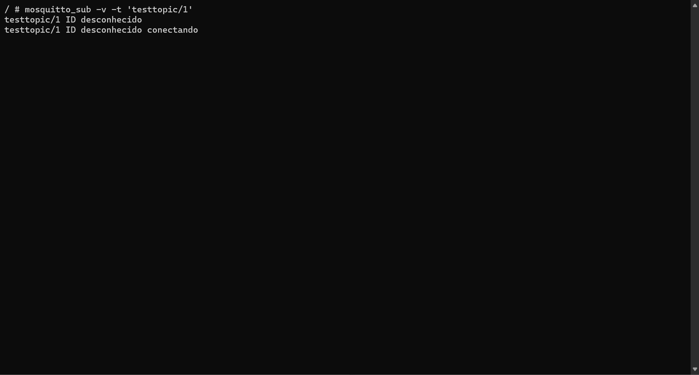
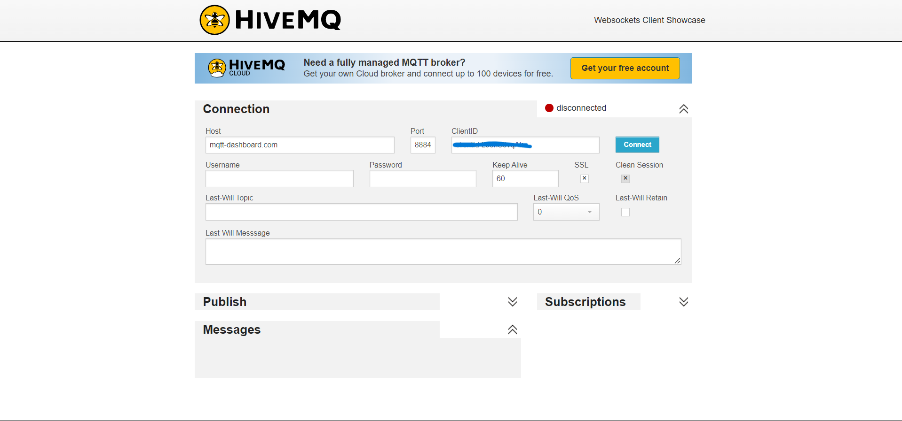
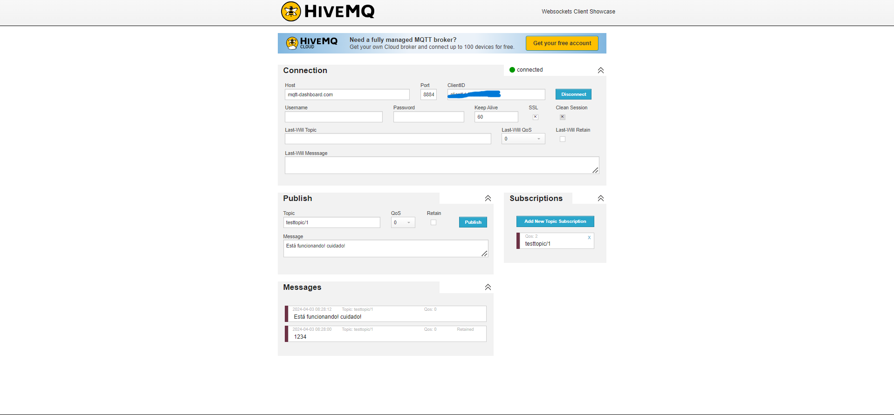
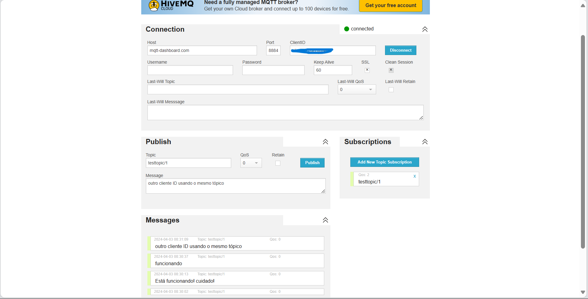
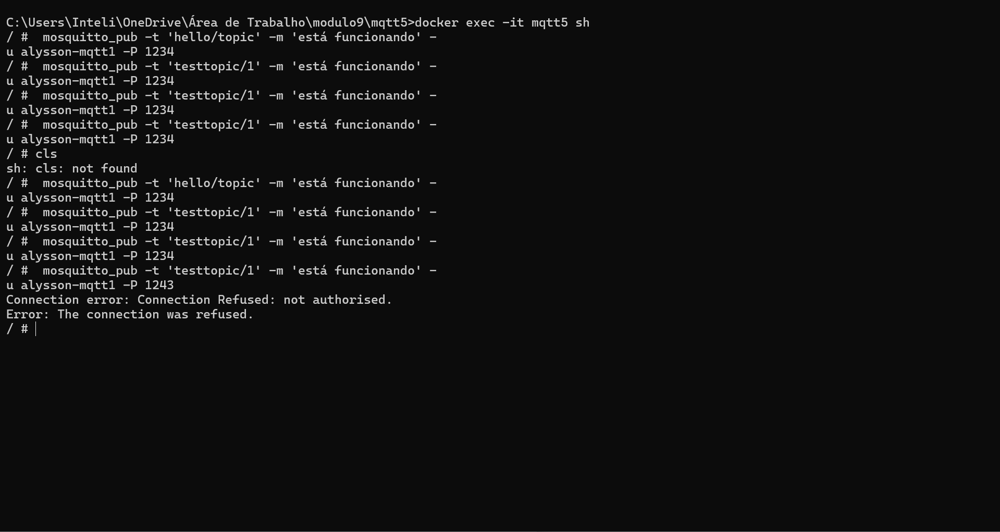
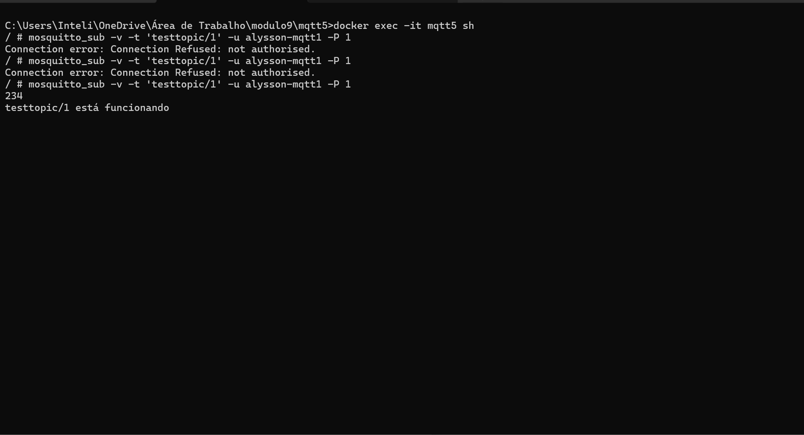
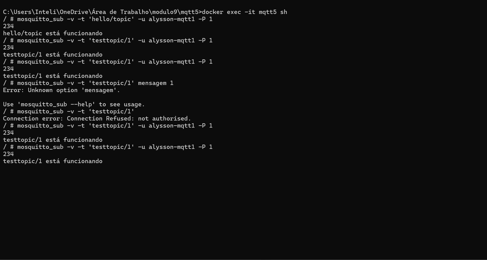

# Simulação de ataques usando MQTT

##### Autor: Alysson C. C. Cordeiro
###### engenharia da computação - Instituto de Tecnologia e Liderança
###### Ponderada 3 - M9 - 2024

---

### Configuração:

Usei o Broker remoto HiveMQ WebSocket Client e Broker local usei o mosquitto

OBS: usei a configuração que está no tutorial do professor orientador Rafael: [Tutorial aqui](https://rmnicola.github.io/m9-ec-encontros/e3)

## Vulnerabilidade de Confidencialidade:

Primeiramente, deve impor de importância que a confidencialidade é um dos pilares fundamentais da segurança da informação,  pois garante que apenas indivíduos autorizados tenham acesso a dados sensíveis. Em ambientes MQTT (Message Queuing Telemetry Transport), por exemplo, a confidencialidade pode ser comprometida quando permitimos conexões anônimas, ou seja, quando o parâmetro ***allow_anonymous*** está definido como ***true*** no arquivo **mosquitto.conf**.

Por esse motivo, ao permitir conexões anônimas, o servidor MQTT, como o Mosquitto, aceita conexões de clientes sem a necessidade de autenticação. Isso significa que qualquer cliente pode se conectar ao broker MQTT e interagir com os tópicos e mensagens sem fornecer credenciais de autenticação. Embora essa configuração possa ser conveniente em alguns cenários, ela também introduz um risco significativo para a confidencialidade dos dados transmitidos.

Veja o exemplo do que aconteceu com Broker local:

Aqui temos um publisher, cujo topico está como **'testtopic/1'**

%2009.01.42_4a2afcda.jpg)

Subscriber recebendo a mensagem pelo tópico correspondente:

%2009.03.53_d62582ab.jpg)

Outro cliente desconhecido conectando e podo mensagens no tópico **'testtopic/1'**

No mesmo terminal do subscriber recebendo mensagens anonimas:

%2009.07.18_8d8fe204.jpg)

Vale resslatar que uma vulnerabilidade específica relacionada à confidencialidade surge quando múltiplas instâncias de um cliente MQTT usam o mesmo ClientID para se conectar ao broker. Como não há autenticação para verificar a unicidade do ClientID, o servidor Mosquitto, por exempo, não impede que várias instâncias se conectem com o mesmo ID de cliente. Logo, isso abre a possibilidade de uma instância do cliente interceptar mensagens destinadas a outra instância com o mesmo ClientID, comprometendo assim a confidencialidade das comunicações.

Veja alguns exemplos agora abaixo com broker remoto HiveMQ web client.

###### ***OBS: Foi apagado o clientID por qeustões de seguranças. Quaisquer dúvidas, entre em contato***

Nesse há outro clientID, o qual acessar o mesmo tópico e publica.

### Qual possível solução para mitigar essa vunerabilidade?

Uma maneira eficaz de mitigar essa vulnerabilidade e proteger a confidencialidade dos dados é desabilitar a conexão anônima, ou seja, configurando ***allow_anonymous*** como ***false*** no arquivo **mosquitto.conf**. Isso exige que os clientes forneçam credenciais de autenticação válidas para se conectarem ao servidor MQTT, garantindo assim a identificação adequada de cada cliente e evitando a reutilização de ClientIDs.

Além disso, é essencial implementar uma camada de autenticação robusta no servidor MQTT, como autenticação baseada em "username" e "senha" ou autenticação baseada em certificado TLS, por exemplo. Pois isso garante que apenas clientes autorizados tenham acesso ao broker MQTT e reduz significativamente o risco de interceptação de mensagens não destinadas.

Veja o exemplo a seguir com alteração para **false**:

Nesta primeira imagem nota-se que a senha correta seria 1234, logo, envia corretamente a mensagem. No entanto, no final, há um erro. Esse erro é senha incorreta que foi digitada: 1243

## Vulnerabilidade de Integridade:

A integridade dos dados e das mensagens publicadas são pilares  mais essenciais da segurança da informação, visto que garante que os dados permaneçam íntegros e não sejam alterados de forma não autorizada durante a transmissão ou armazenamento. Por esse motivo, no contexto de servidores MQTT (Message Queuing Telemetry Transport), a integridade pode ser comprometida por várias vulnerabilidades que permitem a modificação não autorizada de mensagens ou tópicos, foi o exemplo que mostrei anteriormente.

Uma vulnerabilidade comum que compromete a integridade em servidores MQTT é a falta de autenticação - mostrada na simulação no entretexto acima - e até se possível criptografia adequadas. 

Então, quando não são implementados mecanismos de autenticação, os clientes podem publicar ou modificar mensagens em tópicos sem a devida verificação de identidade, como anonimos mesmo. Ratificando, isso significa que um cliente mal-intencionado pode enviar mensagens falsas ou alterar o conteúdo de mensagens legítimas sem ser detectado.

Além disso, sem contar que a ausência de criptografia na comunicação entre clientes e servidor MQTT pode expor os dados a ataques de "man-in-the-middle", onde um invasor intercepta e modifica as mensagens durante a transmissão e comuniçação. E isso, sem criptografia, os dados transmitidos podem ser facilmente adulterados. Então, isso compromete a integridade das informações.

### E quais possiveis soluções?

Para garantir a segurança robusta em sistemas MQTT, é importante implementar medidas de autenticação sólidas, como o uso de username/senha ou autenticação baseada em certificado TLS. O primeiro passo fundamental é configurar o parâmetro ***allow_anonymous*** como ***false*** no arquivo **mosquitto.conf**, o que impede conexões anônimas não autenticadas, que foi o que eu fiz na simulação acima.

Pode-se aplicar criptografia TLS para proteger a comunicação entre clientes e servidores MQTT, assegurando assim a confidencialidade e integridade dos dados transmitidos. 

OU também, se caso possível, implementar assinaturas digitais nas mensagens para verificar a autenticidade e integridade. 

##  Vulnerabilidade de Disponibilidade:

Na parte da disponibilidade, a exploração do ambiente MQTT, conforme o  tutorial do professor orientador Rafael, proporciona uma compreensão mais profunda dos desafios de segurança que cercam os sistemas IoT (internt of thing). Neste contexto, a questão da disponibilidade emerge como um aspecto crítico da segurança da informação, pois os ataques de Negação de Serviço (DoS) podem comprometer severamente a operação dos serviços MQTT.

Então, durante a simulação de um ataque de DoS, identifiquei que o broker MQTT  acaba se tornando indisponível para os clientes legítimos devido à sobrecarga causada pelo grande volume de solicitações maliciosas, exemplo mostrado na simulação acima no primeiro tópico. Isso demonstra como a falta de medidas de segurança adequadas pode comprometer a disponibilidade dos serviços MQTT, impactando negativamente a operação dos dispositivos conectados e interrompendo as comunicações entre eles.

Deste modo, para mitigar a vulnerabilidade de disponibilidade é a implementação de medidas de segurança robusta (a simulação acima não teve uma autenticação robusta, foi usado 1234 para senha, por exemplo) como firewall para bloquear tráfego malicioso e limitação de conexões para evitar a sobrecarga do broker MQTT. Além disso, a utilização de serviços de mitigação de DDoS pode proporcionar uma camada adicional de proteção, garantindo que os serviços MQTT permaneçam acessíveis mesmo sob ataques intensos.

Após a implementação dessas soluções, realizei novas simulações para verificar a eficácia das medidas de segurança. Observei que o broker MQTT permaneceu acessível para os clientes legítimos, mesmo sob o ataque de negação de serviço, demonstrando a eficácia das medidas implementadas na proteção da disponibilidade dos serviços MQTT.

###### NOTA:  ***Foi feito a simulação de uma forma global que está mostrando no ínicio, como um todo, para o cenários de análise de vulnerabilidade (dentro do CIA Triad), identificando situações onde pode ser comprometido cada um dos três pilares: Confiabilidade, Integridade e Disponibilidade.***

---
## Agradecimento:

Ao professor Orientador Rafael que nos deu aula e instrução sobre o conteúdo.

